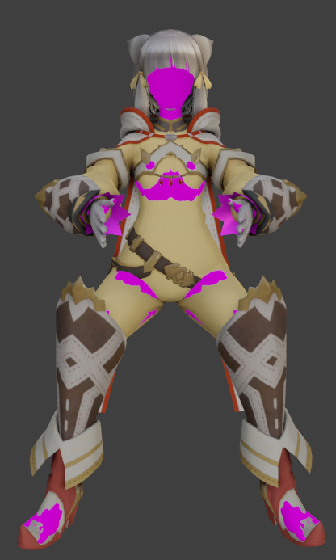

# [Meido-ify a Character](https://github.com/luvoid/COM3D2-All-Bout-Bones/blob/main/wiki/Meidoify-a-Character.md)

**NOTE: This tutorial uses Blender CM3D2 Converter version __luv.2021.01.02__**

This is a more **advance** technique. You need to be more familiar with CM3D2 modding and blender to follow this.

This process makes use of armatures and poses, so you may wanna know how that works in blender. The goal is to align the game's body to some external character's clothing using sliders, then invert all the transforms you make, and morph the clothing back with it, so that in the CM3D2 game, when you create a maid with the same settings, it has the same proportions as the original character.

_It is highly recommended to make **unique** backups before using large operators. You never know when you'll want to go back to a specific step._

_Character_ refers to the non-CM3D2 model that you want to import, and _CM3D2 body_ is the imported stock CM3D2 body model.

There is also an [uncommentated tutorial video](https://drive.google.com/file/d/1rRfEo8L8K0KAYL1nXHpFEbSOcPeTHavK/view?usp=sharing)

### Step 1: Import to Blender
* Get your choice of CM3D2 Body model imported into blender. (Or you could `body001` or `T-Pose body` from the add object menu) 
* Get your non-CM3D2 Character in the same scene, and make sure that it matches the scale you imported the CM3D2 body. If you imported it at the 5x scale then 1 unit = 0.2 meters. (You may be able to look up the character's cannon height if you're not sure what it should be)
* OPTIONAL: If you Character has a skirt, you should import a similar skirt and combine it with with the CM3D2 Body into one armature object. 

### Step 2: Setup the Armatures
* Select the CM3D2 Body's armature object and go to `Properties Window > Armature Tab > CM3D2 Sliders`
* Use the "Connect Sliders" button. Don't press the button repeatedly as connecting while they are already connected may cause problems.
* The Body Sliders and Wide sliders under the Connect Sliders button should not change the CM3D2 Body.

### Step 3: Using Sliders
* By reposing the CM3D2 Body via rotating bones and using **only the sliders to resize/reposition**, adjust the CM3D2 body and try to get all parts to align with the Character's.
  * **NOTE:** You are allowed to change the pose of the CM3D2 Body. The limitation is that you cannot translate or resize the bones. You are free to rotate most bones however you wish.
  * The exception is bones with `_SCL_` in the name. These bones are often in the same place as / overlapping with their non-`_SCL_`counterparts so be careful to not touch these.
* Feel free to move and repose the Character as needed to help it line up with the CM3D2 body. It helps if the pelvis is properly aligned as the sliders do not change this centeral point.
* If the CM3D2 Body you are using has shape keys, you may use those as well. Special shape keys are often needed to get the butt and thighs to align properly.
  * If you're still having trouble aliging the butt, try rotating `Bip01 Pelvis`.
* Repeat this step until you are satisfied with the alignment.

### Step 4: Apply Prime Field
* If you haven't been making backups, you definately want to make one here.
* After the two models are aligned, select the CM3D2 Body armature object, enter Pose Mode, and run `Pose > Apply > Apply Prime Field`.
  * The rest pose of the armature is now what the pose just was.
  * You can use the buttons in the Armature Properties to change the pose to the prime pose and base pose, but save the "Swap Prime Field" button for later.
  * Apply Prime Field will disconnect the body sliders. If you used sliders before, the sliders won't work corretly on a primed armature.
* OPTIONAL: At this point feel free to scale / move / rotate any bones manually to further make the models line up. This is a good time to fix any minor clippings.
  * IF you chose to do this, keep in mind that these changes won't be able to be replicated in game, so save it for minor adjustments only.
  * When you are done, you will have to Apply Prime Field again; this time with "Keep Origial" enabled.

### Step 5: Vertex Groups
* Next the vertex groups need to be transferred from the CM3D2 body to the character. This can be done the old fashion way, using CM3D2-Converter, or using [`COM3D2_Referenced_Vertex_Weight_Transfer.py`](../scripts/COM3D2_Referenced_Vertex_Weight_Transfer.py).
* Join (`Ctrl J`) a copy of the character into a copy of the CM3D2 body to become what will now be referred to as the _CM3D2 Character_.
* Copies of the Character's clothing mesh also needs to parented to the new CM3D2 Character's armature object.
  * To parent an object without it moving, select to object, then it's parent, then use `Ctrl P` and select "Object (keep transform)".
  * Make sure to add/fix new armature-mesh-modifiers into all of the new meshes to the new armature.
* Also fix the Character Mesh's orientation now. Do this by using "Align to Base Bone" in `Properties Window > Object Tab > Transform`.

### Step 6: Bones
* Move extra bones from the Character's half of the CM3D2 Character's armature to some appropriate bones in the CM3D2 Body's half.
* Decide what bones you want to be scaled with [\_SCL_ bones](Scaling-Bones.md) and follow their step 1 & 2 (but not step 3 yet).
* Sort out and rename your [dynamic bones](Dynamic-Bones.md) now, or else you'll need to come back to this step later if you need to change their hierarchy to be under a different \_SCL_ bone.

### Step 7: Cleanup
* Go ahead and preview the base pose by pressing the "Original Pose" button in the CM3D2 Character's Armature Properties.
* Now is the time to clean vertex groups, bones, or any other issues you find. If something was morphed in a strange way it's likely due to bad vertex weights. Vertex weights can be cleaned up by hand without having to reverse any steps.

### Step 8: Shape Key Transfers
* This step could optionally be done after step 9, but usually it is better to do it now.
* Transfer the shape keys from the CM3D2 body mesh to the clothing. Since you have already setup the vertex groups you can use the "Referenced Shape Key Transfer" operator in `Properties Window > Mesh Tab > Shape Keys > Down-Arrow`.
* You will want to enable the "Bind to source mix" option. This will adjust the Character's base shape according to how the body is currently shaped.

### Step 9: Magic!
* Again, make sure you are making backups. Now is especially important.
* Now is the time to use the "Swap Prime Field" button in the CM3D2 Character's Armature Properties.
* If everything worked correctly, the character mesh should be morphed to fit the default posed CM3D2 body.
* If something seems off, it's likely that some vertex weights need fixing back at step 7. There is a slight chance that something was done wrong all the way back at step 4.

### Step 10: Removing Extras
* In the CM3D2 Character's Armature Properties, use the "Cleanup Scale Bones" button to remove any uneeded scale bones.
  * The scale bones you need to keep for your [Scaling Bones: Step 3](Scaling-Bones.md#step-3-edit-the-bone-data) (which you should also do now) should automatically remain if you had the "Keep Bones With Children" option enabled. 
* Use BoneUtil to add any custom bones to the bone data.
* OPTIONAL: Import a fresh CM3D2 Body to double check everything and maybe fix any shapekeys as needed.

### Step 11: Export
Finally, just follow the normal procedures that you would for any other CM3D2 model. There are many tutorials you can find detailing this.

